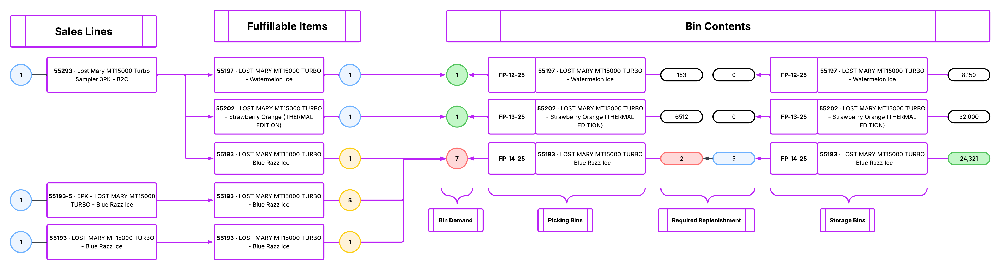

# Bin Location Extension

AL extension that exposes warehouse and assembly data through Business Central APIs, with support for bin reassignment on assembly lines through a service-enabled procedure.

## What This Extension Includes

- Read-only warehouse reference APIs:
	- Bin Content (`binContents`)
	- Bin Type (`binTypes`)
	- Zone (`zones`)
- Sales line API with bin field exposed and write enabled (`salesLine_wBins`)
- Assembly integration APIs:
	- Assemble-to-Order link (`assemblyLinks`)
	- Assembly header (`assemblyHeaders`)
	- Assembly line with write enabled (`assemblyLines`)
- Service-enabled codeunit procedure to reassign an assembly line bin:
	- `ReassignAssemblyLineBin(AssemblyLineId: Guid; NewBinCode: Code[20])`

## Extension Metadata

- Name: Bin Location Extension
- Publisher: Mi-One Brands
- Version: 1.0.0.4
- Runtime: 16.0
- Application: 27.0.0.0
- Object range: 50201-50250

## API Surface

All API pages use:

- `APIPublisher = mioneBrands`
- `APIGroup = warehouse`
- `APIVersion = v1.0`
- `ODataKeyFields = SystemId`

Base API pattern:

```text
https://api.businesscentral.dynamics.com/v2.0/{tenant}/{environment}/api/mioneBrands/warehouse/v1.0/companies({companyId})/{entitySet}
```

### 50201 Bin Content API

- Entity set: `binContents`
- Source table: `Bin Content`
- Access: read-only
- Key fields exposed: `id`, `locationCode`, `zoneCode`, `binCode`, `itemNo`, `variantCode`, `unitOfMeasureCode`, `quantityBase`, `fixed`, `defaultBin`, `dedicated`, `binRanking`, `blockMovement`, `lastModifiedDateTime`

### 50202 Bin Type API

- Entity set: `binTypes`
- Source table: `Bin Type`
- Access: read-only
- Key fields exposed: `id`, `code`, `description`, `receive`, `ship`, `putAway`, `pick`, `lastModifiedDateTime`

### 50203 Zone API

- Entity set: `zones`
- Source table: `Zone`
- Access: read-only
- Key fields exposed: `id`, `locationCode`, `code`, `description`, `binTypeCode`, `warehouseClassCode`, `specialEquipmentCode`, `zoneRanking`, `crossDockBinZone`, `lastModifiedDateTime`

### 50204 Sales Line API

- Entity set: `salesLine_wBins`
- Source table: `Sales Line`
- Access: read/write (`InsertAllowed`, `ModifyAllowed`, `DeleteAllowed`)
- Includes bin-aware fields such as `locationCode` and `binCode`

### 50205 Assembly Link API

- Entity set: `assemblyLinks`
- Source table: `Assemble-to-Order Link`
- Access: read-only

### 50206 Assembly Header API

- Entity set: `assemblyHeaders`
- Source table: `Assembly Header`
- Access: read-only
- Includes header-level `binCode` and quantity/status fields

### 50207 Assembly Line API

- Entity set: `assemblyLines`
- Source table: `Assembly Line`
- Access: write enabled (`InsertAllowed`, `ModifyAllowed`, `DeleteAllowed`)
- Includes `locationCode` and `binCode` for line-level control

## Assembly Bin Reassignment Procedure

Object: Codeunit 50208 `Assembly Line Bin Reassign`

Service-enabled procedure:

```al
[ServiceEnabled]
procedure ReassignAssemblyLineBin(AssemblyLineId: Guid; NewBinCode: Code[20]): Text
```

Behavior summary:

1. Validates `AssemblyLineId` is provided.
2. Trims/normalizes `NewBinCode`.
3. Finds assembly line by `SystemId`.
4. Requires line `Location Code`.
5. Validates target bin exists in that location.
6. Validates and updates `Bin Code` on the line.
7. Returns a success message with document and line details.

Possible errors returned:

- `AssemblyLineId is required.`
- `NewBinCode is required.`
- Assembly line not found by SystemId
- Missing location code on assembly line
- Bin does not exist for the line location

## Usage Examples

### Get assembly lines

```http
GET /api/mioneBrands/warehouse/v1.0/companies({companyId})/assemblyLines?$filter=documentNo eq 'AS-000123'
```

### Update binCode directly on Assembly Line API

```http
PATCH /api/mioneBrands/warehouse/v1.0/companies({companyId})/assemblyLines({systemId})
Content-Type: application/json

{
	"binCode": "PICK-01-01"
}
```

### Update binCode directly on Sales Line API

```http
PATCH /api/mioneBrands/warehouse/v1.0/companies({companyId})/salesLine_wBins({systemId})
Content-Type: application/json

{
	"binCode": "SHIP-DOCK-01"
}
```

### Invoke reassignment codeunit procedure

The `ServiceEnabled` procedure is called through a published web service endpoint for the codeunit. If not already published, publish codeunit 50208 on the Web Services page in Business Central first.

```text
POST {service-endpoint-for-codeunit-50208}
Payload: AssemblyLineId + NewBinCode
```

## Development And Debugging

Current launch profile:

- Environment type: Sandbox
- Environment name: `ProdCopy_20260401`
- Authentication: AAD
- Break on error: All
- SQL diagnostics enabled for long-running statements

Recommended local workflow:

1. Download symbols.
2. Build and publish extension.
3. Run API calls from Postman or REST client.
4. Set breakpoints in API page triggers or codeunit procedure.
5. Re-run request and inspect call stack/record state.

## API Debug Checklist (Bin Code Updates)

Use this when bin updates from API requests do not apply as expected.

1. Confirm request targets the correct entity set (`assemblyLines` or `salesLine_wBins`).
2. Verify the record key uses the `SystemId` GUID expected by `ODataKeyFields`.
3. Validate `locationCode` exists on the line before setting `binCode`.
4. Confirm bin exists in table `Bin` for the same location.
5. Check user/API permissions for modify access on source tables.
6. Put a breakpoint in codeunit 50208 and verify `Validate("Bin Code", ...)` runs.
7. Compare direct `PATCH` behavior versus codeunit-based reassignment behavior.
8. Capture full request/response payloads and BC telemetry for failed calls.

## Diagram



## To-Do

- [ ] Add Postman collection for all entity sets and standard filters.
- [ ] Document exact production endpoint format for codeunit 50208 service invocation.
- [ ] Add automated API smoke tests for read-only warehouse endpoints.
- [ ] Add integration tests for `PATCH` updates to `assemblyLines.binCode` and `salesLine_wBins.binCode`.
- [ ] Create a dedicated debugging playbook for bin code update failures via API requests (breakpoints, payload validation, permission checks, and bin/location cross-checks).
- [ ] Add error response catalog with sample payloads for all known validation failures.
- [ ] Add versioned changelog section in this README.
